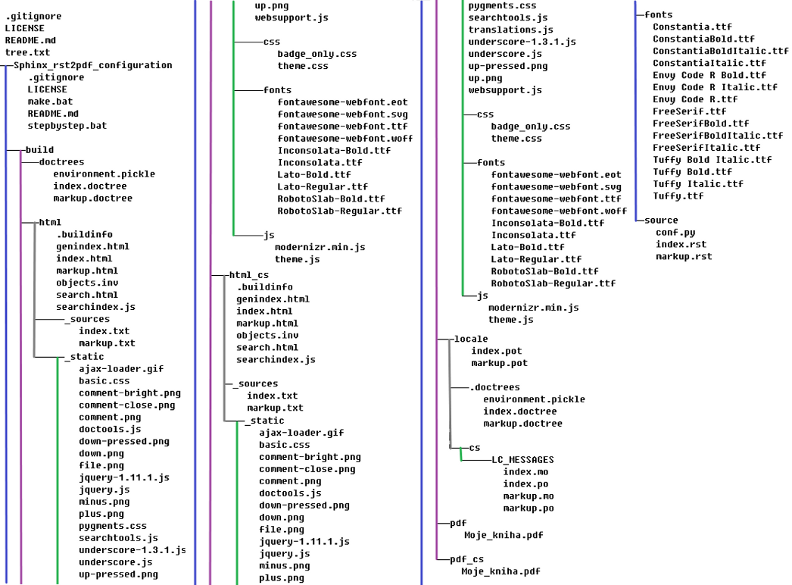

.. header : :    This is in index.rst file ###Page###

  
.. Blender documentation master file, created by
   sphinx-quickstart on Fri Sep 04 23:42:02 2015.
   You can adapt this file completely to your liking, but it should at least
   contain the root `toctree` directive.

Welcome to SomeThing's documentation!
===================================

I don't know what to write here just now.

Second document is desription of well known rst syntax.

Structure of files in my directory is on this picture:

   Tree structure of my working directory

.. toctree::
   :maxdepth: 1

   markup.rst

Contents:

.. code-block:: rst
   

Indices and tables
==================

* :ref:`genindex`
* :ref:`modindex`
* :ref:`search`

